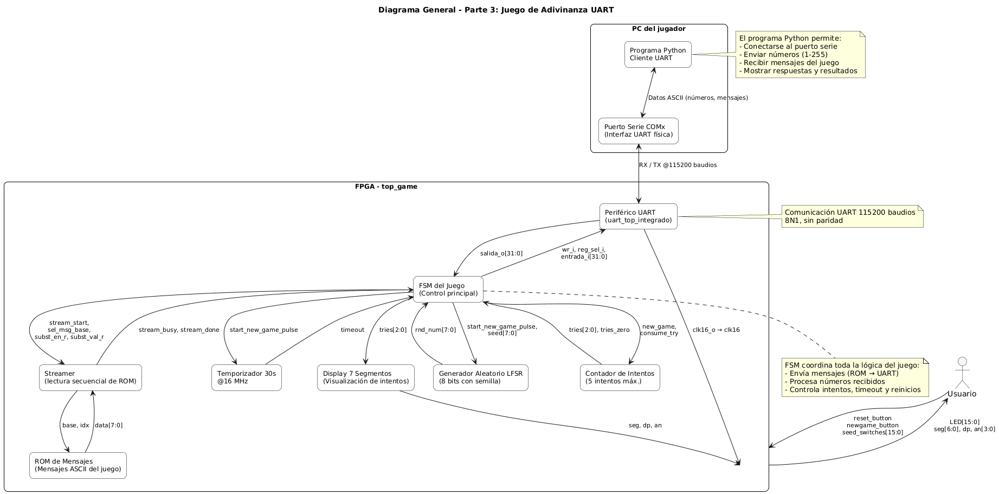
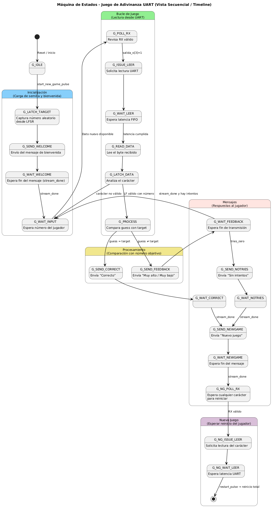
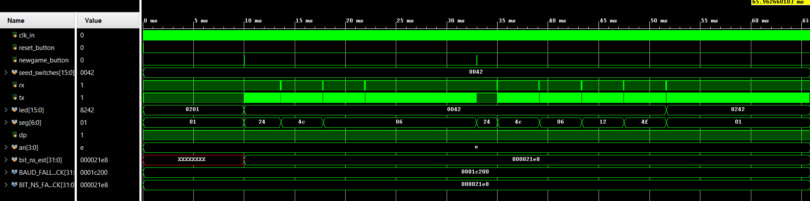

# Laboratorio 3 / Parte 3 – Aplicación: Juego de Adivinanza UART

## 1. Abreviaturas y Definiciones

- **UART**: Universal Asynchronous Receiver Transmitter  
- **FIFO**: First In, First Out  
- **LFSR**: Linear Feedback Shift Register  
- **FSM**: Finite State Machine  
- **ROM**: Read-Only Memory  

---

## 2. Contexto General

Este proyecto forma parte del **Laboratorio 3 – Interfaces con periféricos** del curso *EL3313 Taller de Diseño Digital*.  
El laboratorio se divide en tres partes principales:

1. **Parte 1 – FIFO**: Implementación de una memoria FIFO de 8 bits y 512 palabras mediante el IP *FIFO Generator*.  
2. **Parte 2 – Periférico UART**: Desarrollo de un periférico UART completo con registro de control, FIFOs de transmisión y recepción, y comunicación serial bidireccional.  
3. **Parte 3 – Aplicación**: Integración de los módulos anteriores en una aplicación funcional, un **juego de adivinanza** que interactúa con el usuario a través del puerto serie.

---

## 3. Desarrollo

### 3.1 Planteamiento del Diseño

El sistema implementa un **juego de adivinanza numérica** entre una **FPGA (anfitrión)** y una **computadora externa (cliente UART)**.

_Diagrama general de interconexión del sistema_

**Flujo general:**  
1. La FPGA genera un número aleatorio entre 1 y 255 usando un LFSR de 8 bits.  
2. El usuario, mediante un programa Python en la PC, envía números por UART para adivinar.  
3. El sistema compara el valor recibido con el número secreto y responde con mensajes almacenados en ROM.  
4. El usuario tiene 5 intentos. Si los agota o acierta, el sistema muestra el mensaje final y espera un nuevo juego.  

---

### 3.2 Componentes Principales del Sistema

#### 3.2.1 Módulo `lfsr8_seeded`
Genera números pseudoaleatorios de 8 bits con una semilla configurable.

```systemverilog
module lfsr8_seeded (
  input  logic       clk,
  input  logic       rst,
  input  logic       load_seed,
  input  logic [7:0] seed,
  input  logic       enable,
  output logic [7:0] rnd
);
```
**Descripción:**
- Implementa la ecuación de retroalimentación `x^8 + x^6 + x^5 + x^4 + 1`.  
- La salida se actualiza en cada ciclo cuando `enable=1`.  
- El estado 0 se evita para garantizar secuencias válidas.

---

#### 3.2.2 Módulo `tries_counter`
Controla el número de intentos disponibles (máximo 5).

```systemverilog
module tries_counter (
  input  logic clk,
  input  logic rst,
  input  logic new_game,
  input  logic consume_try,
  output logic [2:0] tries,
  output logic zero
);
```
**Funcionamiento:**
- Se inicializa con 5 intentos al inicio o con `new_game=1`.  
- Decrementa en cada intento fallido.  
- `zero` indica que no quedan intentos.  

---

#### 3.2.3 Módulo `timer_30s_16mhz`
Temporizador que mide 30 segundos a 16 MHz.

```systemverilog
module timer_30s_16mhz (
  input  logic clk,
  input  logic rst,
  input  logic start,
  input  logic kick,
  output logic timeout
);
```
- Permite reiniciar el juego si no hay interacción durante 30 s.  
- `timeout` se activa al finalizar el conteo.

---

#### 3.2.4 Módulo `rom_msgs_if` y `rom_msgs_pkg`
Interfaz y paquete de direcciones base para los mensajes almacenados en ROM.

| Mensaje | Dirección Base | Contenido |
|----------|----------------|-----------|
| BASE_WELCOME | 0 | “Adivina el número entre 1 y 255!” |
| BASE_HIGH | 35 | “El número es menor. Intenta de nuevo.” |
| BASE_LOW | 75 | “El número es mayor. Intenta de nuevo.” |
| BASE_CORRECT | 115 | “Felicidades! Adivinaste el número en X intentos.” |
| BASE_NOTRIES | 166 | “Lo siento! Se han acabado los intentos.” |
| BASE_NEWGAME | 208 | “Envia cualquier caracter para iniciar un nuevo juego.” |

---

#### 3.2.5 Módulo `uart_msg_streamer`
Envía secuencialmente los mensajes almacenados en la ROM a través del periférico UART.

```systemverilog
module uart_msg_streamer #(
  parameter int MAX_LEN = 512
)( ... );
```
**Características:**
- Recorre los bytes del mensaje desde la dirección base.  
- Reemplaza el carácter `'X'` por el número real de intentos usados.  
- Controla las señales de escritura (`wr_o`, `reg_sel_o`) hacia el periférico UART.  
- Señales `busy` y `done` indican estado de transmisión.

---

#### 3.2.6 Módulo `sevenseg_one_active_low`
Muestra el número de intentos restantes en el display de 7 segmentos.

_Visualización de intentos restantes en el display_

---

#### 3.2.7 Módulo Principal `top_game`

Integra todos los bloques anteriores y maneja la FSM principal del juego.

```systemverilog
module top_game (
  input  logic clk_in,
  input  logic reset_button,
  input  logic newgame_button,
  input  logic [15:0] seed_switches,
  output logic [15:0] led,
  output logic [6:0] seg,
  output logic dp,
  output logic [3:0] an,
  input  logic rx,
  output logic tx
);
```
**Funciones del módulo:**
- Inicializa el LFSR con la semilla seleccionada.  
- Coordina los mensajes de la ROM con el streamer UART.  
- Controla intentos, comparaciones y reinicio del juego.  
- Muestra en LEDs y display el estado actual del sistema.

---

### 3.3 Máquina de Estados Finita (FSM)

La FSM controla las fases principales del juego:

_Diagrama de la máquina de estados del juego_

| Estado | Descripción |
|---------|--------------|
| `G_IDLE` | Espera un nuevo juego. |
| `G_LATCH_TARGET` | Captura el número aleatorio. |
| `G_SEND_WELCOME` / `G_WAIT_WELCOME` | Envía mensaje de bienvenida. |
| `G_WAIT_INPUT` | Espera número desde UART. |
| `G_PROCESS` | Compara el número con el objetivo. |
| `G_SEND_FEEDBACK` / `G_WAIT_FEEDBACK` | Envía “mayor/menor”. |
| `G_SEND_CORRECT` / `G_WAIT_CORRECT` | Envía mensaje de acierto. |
| `G_SEND_NOTRIES` / `G_WAIT_NOTRIES` | Sin intentos. |
| `G_SEND_NEWGAME` / `G_WAIT_NEWGAME` | Muestra prompt de reinicio. |

---

| **Estado / Grupo** | **En el diagrama** | **Contexto funcional** |
|---------------------|--------------------------------|-------------------------------|--------------------------------------|
| **G_IDLE** | En el bloque **Inicialización** → estado inicial (punto negro) → `G_IDLE`| FSM en reposo esperando `start_new_game_pulse` (botón o reinicio). |
| **G_LATCH_TARGET** | En bloque **Inicialización**| Carga el número aleatorio desde el LFSR (semilla). |
| **G_SEND_WELCOME / G_WAIT_WELCOME** | En bloque **Inicialización** | Envía el mensaje de bienvenida por UART y espera que termine la transmisión. |
| **G_WAIT_INPUT** | En bloque **Bucle de juego** | Espera la entrada del usuario desde la UART (el número a adivinar). |
| **G_PROCESS** | En bloque **Procesamiento**| Compara el número ingresado (`guess`) con el número objetivo (`target`). |
| **G_SEND_FEEDBACK / G_WAIT_FEEDBACK** | En bloque **Mensajes** | Envía y espera mensaje de “mayor” o “menor” según el resultado de la comparación. |
| **G_SEND_CORRECT / G_WAIT_CORRECT** | En bloque **Mensajes**| Envía mensaje de acierto y luego prepara el mensaje de “nuevo juego”. |
| **G_SEND_NOTRIES / G_WAIT_NOTRIES** | En bloque **Mensajes**| Se activa cuando se acaban los intentos; envía mensaje de “sin intentos”. |
| **G_SEND_NEWGAME / G_WAIT_NEWGAME** | En bloque **Mensajes** (final del flujo)| Muestra el prompt “envía cualquier carácter para iniciar un nuevo juego”. |
| *(G_NG_POLL_RX / G_NG_ISSUE_LEER / G_NG_WAIT_LEER)* | En bloque **Nuevo juego** (fase final del diagrama)| No están en la tabla resumida, pero implementan el **reinicio real** cuando llega un carácter desde UART. |


## 4. Testbench – `tb_top_game`

El testbench verifica el funcionamiento del sistema completo **sin UART física**.  
Simula secuencias de entrada y revisa que las respuestas coincidan con las esperadas.

**Objetivos:**
- Validar FSM, ROM, contador de intentos y reinicio.  
- Comprobar sustitución de `'X'` en mensajes correctos.  
- Evaluar temporizador y manejo de timeout.  

_Simulación del sistema completo_

---

## 5. Observaciones y Resultados

- El sistema logra una comunicación coherente con la PC a través del UART a 115200 baudios.  
- Los mensajes son transmitidos correctamente desde la ROM y procesados por el `uart_msg_streamer`.  
- El display muestra correctamente los intentos restantes.  
- El `tries_counter` y `timer_30s_16mhz` sincronizan adecuadamente con el flujo del juego.  

**Limitaciones encontradas:**
- Se observaron retrasos en la actualización del display durante la transmisión de mensajes extensos.  
- El testbench requiere ciclos adicionales de espera para sincronizar lecturas UART simuladas.  

---

## 6. Conclusiones

- Se integraron exitosamente los módulos **FIFO**, **UART**, **ROM**, **LFSR** y **FSM** en una aplicación funcional.  
- La metodología modular facilitó la depuración y pruebas parciales.  
- Se comprobó la importancia del control de temporización y sincronización en sistemas UART.  
- El sistema es completamente sintentizable y se comporta correctamente en simulación.  

---

**Autores:**  
Proyecto desarrollado por el grupo de trabajo del curso **EL3313 Taller de Diseño Digital**, II Semestre 2025.

