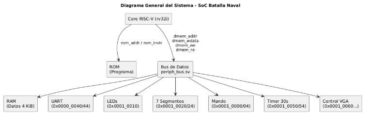
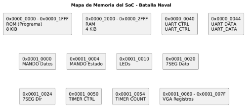
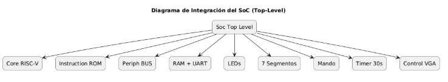
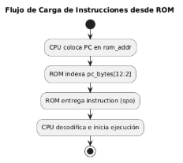
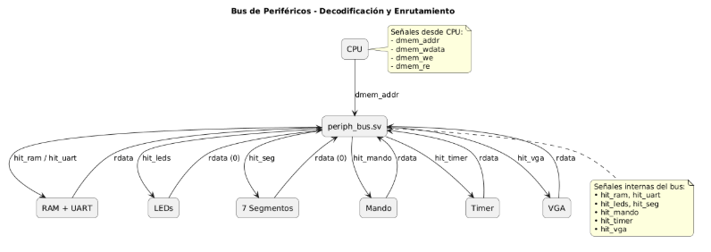
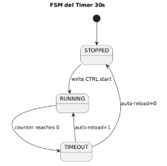
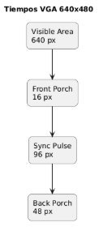
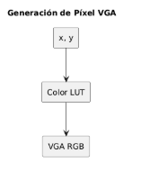
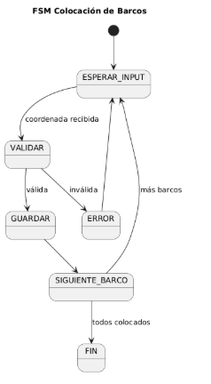
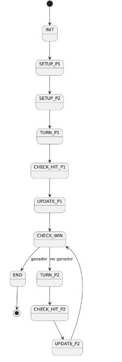

# Proyecto Final – Batalla Naval con Microcontrolador RISC-V
## README.md — Parte 1/3 (Completa)

## 1. Abreviaturas y Definiciones
- **FPGA:** Field Programmable Gate Array
- **RISC-V rv32i:** Arquitectura de 32 bits para enteros.
- **SoC:** System-on-Chip, integración de CPU + memorias + periféricos.
- **UART:** Universal Asynchronous Receiver/Transmitter.
- **MMIO:** Memory-Mapped I/O.
- **VGA:** Video Graphics Array.
- **ALU:** Arithmetic Logic Unit.
- **FSM:** Finite State Machine.
- **PC:** Program Counter.

---

## 2. Contexto General del Proyecto

El proyecto consiste en implementar el juego *Battleship* completamente sobre una FPGA Basys3.  
El sistema incluye:

- Un **microcontrolador RISC-V rv32i** diseñado por los estudiantes.
- Una ROM con el programa en ensamblador.
- RAM + UART integrados.
- Periféricos MMIO: LEDs, 7 segmentos, Timer, Mando, VGA.
- Comunicación serial UART con una PC (Jugador 2).
- Visualización del tablero usando un monitor VGA.
- Navegación y control por medio de un mando físico (Jugador 1).

El procesamiento central lo ejecuta el microcontrolador a 16 MHz, mientras que la VGA utiliza un reloj de 25 MHz.

---

## 2.1 Jugadores del Sistema
- **Jugador 1:** Mando físico conectado a la FPGA (6 botones).
- **Jugador 2:** Computadora mediante UART (115200 8N1).

---

## 2.2 Procesamiento Principal del Sistema
El núcleo RISC-V ejecuta el programa del juego en ensamblador y controla:
- Colocación de barcos
- Validación de ataques
- Manejo de turnos
- Comunicación UART
- Actualización de LEDs y 7 segmentos
- Visualización VGA

---

## 2.3 Diagrama General del Sistema (PlantUML)

_Diagrama general de interconexión del sistema_

# 3. Arquitectura del Sistema

La arquitectura del sistema se fundamenta en los siguientes módulos:

1. Módulo TOP (`uniciclo_soc.sv`)
2. Núcleo RISC-V (`uniciclo.sv`)
3. ROM de instrucciones (`instruction_rom_ip`)
4. RAM + UART (`periph_uart.sv`)
5. Bus de periféricos (`periph_bus.sv`)
6. Periféricos MMIO: LEDs, 7seg, Timer, Mando
7. Controlador VGA
8. Mando físico del jugador 1

---

## 3.1 Estructura General del Mapa de Memoria

### Mapa real del sistema (implementación final):

| Región | Dirección | Tamaño | Notas |
|-------|-----------|--------|-------|
| **ROM** | `0x0000_0000 – 0x0000_1FFF` | 8 KiB | Programa del juego (.coe) |
| **RAM** | `0x0000_0000 – 0x0000_0FFF` | 4 KiB | Compartida con UART |
| **UART CTRL** | `0x0000_0040` | 4 B | Registro de control |
| **UART DATA** | `0x0000_0044` | 4 B | Registro de transmisión/recepción |
| **MANDO Datos** | `0x0001_0000` | 4 B | Coordenadas / botones |
| **MANDO Estado** | `0x0001_0004` | 4 B | Flags del debouncer |
| **LEDs** | `0x0001_0010` | 4 B | Write–only |
| **7 Segmentos** | `0x0001_0020 / 24` | 8 B | Dígito 0 y 1 |
| **Timer** | `0x0001_0050 / 54` | 8 B | CTRL + Counter |
| **VGA** | `0x0001_0060 – 0x0001_007F` | 32 B | Registros de gráficos |

---

## 3.1.1 Diagrama del Mapa de Memoria

_Diagrama general de interconexión del sistema_

## 3.2 Módulo TOP — `uniciclo_soc.sv`

El módulo TOP integra:

- Relojes derivados (16 MHz core y 25 MHz VGA)
- Núcleo RISC-V
- ROM de instrucciones
- Bus de datos unificado
- Periféricos MMIO
- Señales de entrada/salida de la Basys3

---

## 3.2.1 Diagrama de Integración (Top-Level)

## 3.3 Core RISC-V (rv32i)

El núcleo implementa:
- Banco de registros completo
- ALU parametrizada
- ImmGen
- Unidad de control + ALUCtrl
- Módulos de PC y PC_next
- Multiplexores WB y ALUSrc
- Buses separados para instrucciones y datos

# 4. ROM — Memoria de Programa

La ROM almacena el programa completo del juego en lenguaje ensamblador RISC-V.  
En tu sistema:

- Tamaño: **8 KiB** (2048 instrucciones)
- Dirección base: **0x0000_0000**
- Punto de entrada: **PC = 0**
- Fuente de datos: archivo **.coe** generado por Vivado

La ROM se implementa con una **IP dist_mem_gen** configurada como memoria de solo lectura.

### 4.1 Flujo de Carga de Instrucciones

# 5. RAM — Memoria de Datos

La RAM se implementa dentro del módulo `periph_uart.sv` junto con la UART.  
Características:

- Tamaño: **4 KiB**
- Dirección: **0x0000_0000 – 0x0000_0FFF**
- Acceso: lectura/escritura sincronizada
- Organización: palabras de 32 bits
- Soporta acceso simultáneo CPU ↔ UART mediante decoder interno

# 6. Bus de Periféricos — `periph_bus.sv`

El bus es responsable de enrutar correctamente accesos del core hacia:

- RAM
- UART
- LEDs
- 7 segmentos
- Mando
- Timer
- VGA

Esto se logra por comparación exacta de direcciones (**hit detection**).

### 6.1 Diagrama del Bus de Periféricos

# 7. Periféricos del Sistema

A continuación se detalla cada periférico requerido y su implementación.

---

## 7.1 Periférico Mando (Jugador 1)

El mando físico del jugador 1 cuenta con **6 botones**:

- Arriba  
- Abajo  
- Izquierda  
- Derecha  
- Seleccionar  
- Rotar  

La interfaz tiene dos registros MMIO:

| Dirección | Registro | Función |
|----------|----------|---------|
| `0x0001_0000` | DATA | Contiene coordenadas X/Y + flags |
| `0x0001_0004` | STATE | Bits de estado depurados |

### 7.1.1 Mapa de Bits del Registro DATA

| Bits | Significado |
|------|-------------|
| [7:0] | X |
| [15:8] | Y |
| [16] | Selección |
| [17] | Rotación |
| [18] | Cancelar |
| [23:19] | Direccionales |

## 7.2 UART (Jugador 2)

Implementa comunicación **115200 8N1**, con:

- Registro **CTRL** → `0x0000_0040`
- Registro **DATA** → `0x0000_0044`
- TX FIFO
- RX FIFO
- Señales internas de estado:
  - tx_ready
  - rx_ready
  - parity error (opcional)

## 7.3 Periférico LEDs

- Dirección: `0x0001_0010`
- 16 bits de salida directa
- Uso en el proyecto para detectar los botones del mando

## 7.4 Periférico 7 Segmentos

Dos dígitos:

- Dígito 0 → puntos del jugador 1  
- Dígito 1 → puntos del jugador 2  

Direcciones:

- `0x0001_0020`
- `0x0001_0024`

### 7.4.1 Mapa de Segmentos

| Segmento | Bit |
|----------|-----|
| a | 0 |
| b | 1 |
| c | 2 |
| d | 3 |
| e | 4 |
| f | 5 |
| g | 6 |

---

## 7.5 Timer 30s

Direcciones:

- CTRL → `0x0001_0050`
- COUNT → `0x0001_0054`

### 7.5.1 Bits del CTRL

| Bit | Función |
|------|---------|
| 0 | Start |
| 1 | Auto-reload |
| 2 | Timeout |

### 7.5.2 FSM del Timer

## 7.6 Controlador VGA

Parámetros:

- Resolución: **640 × 480**
- Frecuencia de pixel clock: **25 MHz**
- Información almacenada en registros MMIO a partir de `0x0001_0060`

### 7.6.1 Tiempos VGA

### 7.6.2 Construcción de un píxel

# 8. Lógica del Juego en Ensamblador RISC-V

El programa en ensamblador implementa la lógica completa del juego Battleship:

1. **Inicialización del sistema**
2. **Colocación de barcos (Jugador 1 y Jugador 2)**
3. **Fase de juego (ataques alternados)**
4. **Detección de victoria**
5. **Pantalla final y reinicio**

A continuación se documenta cada etapa.

---

## 8.1 Etapa 1 — Inicialización

Objetivo:
- Limpiar RAM
- Resetear periféricos
- Mostrar pantalla de bienvenida
- Esperar confirmación de ambos jugadores

## 8.2 Etapa 2 — Colocación de Barcos

Cada jugador coloca:
- 1 barco de tamaño 4
- 2 barcos de tamaño 3
- 3 barcos de tamaño 2
- 4 barcos de tamaño 1

Validaciones:
- No salir del tablero
- No solapar barcos
- Respetar orientación
- Actualizar RAM correspondiente

FSM de colocación:

## 8.3 Etapa 3 — Fase de Juego (Ataques)

Cada turno:

1. Timer inicia en 30s  
2. Jugador activo selecciona coordenada  
3. CPU verifica:
   - ¿Fuera del tablero?
   - ¿Ataque repetido?
   - ¿Barco enemigo impactado?  
4. CPU actualiza:
   - Tablero
   - LEDs
   - VGA
   - UART (para Jugador 2)

FSM principal del juego:

## 8.4 Etapa 4 — Fin del Juego

- Se muestra ganador en VGA
- LEDs indican estado final
- Se envía mensaje por UART
- Se espera reinicio

---

# 9 Programa en Python (Jugador 2) — Explicación General

El software en Python cumple el rol del **Jugador 2** en el sistema de Batalla Naval y funciona como la contraparte de la FPGA. Su propósito no es reemplazar la lógica del hardware, sino **interactuar con el SoC**, visualizar el progreso de la partida y enviar información al juego.

En términos generales, el programa realiza tres funciones principales:

---

## 9.1 Interfaz con la FPGA mediante UART

El programa abre un puerto serial **115200 baudios (8N1)** y se comunica con el microcontrolador RISC-V usando bytes empaquetados.  
Esta comunicación permite:

- Recibir notificaciones desde la FPGA (turno, hits, misses, fin de juego).
- Enviar comandos de configuración de barcos.
- Enviar disparos del Jugador 2 hacia el SoC.
- Confirmar turnos y estados.

El enlace UART convierte la PC en un **jugador remoto**, tal como especifica el proyecto.

---

## 9.2 Interfaz Gráfica (Tkinter)

El programa incluye una GUI con dos tableros:

- **Tablero propio (Jugador 2)**
- **Tablero enemigo (Jugador 1)**

La interfaz muestra:

- Barcos
- Disparos (hit/miss)
- Cursores de selección
- Mensajes de estado
- Último ataque realizado
- Puntaje o progresión

Esto permite visualizar el avance de la partida en tiempo real, incluso cuando la acción principal ocurre dentro de la FPGA.

---

## 9.3 Lógica del Juego del Lado del Jugador 2

El Python no reemplaza la lógica del SoC; solo complementa la interacción de un jugador humano.  
Las funciones principales son:

### Colocación asistida de barcos  
El usuario coloca barcos mediante el teclado (o los genera automáticamente).  
Luego, el programa envía las coordenadas a la FPGA mediante UART.

### Selección de disparos  
El jugador mueve un cursor sobre el tablero enemigo y presiona ENTER para atacar.  
El Python:
- Actualiza su tablero localmente,
- Envía las coordenadas del ataque a la FPGA,
- Espera la respuesta del hardware (hit/miss).

### Visualización del flujo de la partida  
El programa recibe bytes desde la FPGA indicando:
- De quién es el turno,
- Si hubo impacto,
- Si un jugador ganó,
- Si hay mensajes especiales.

La GUI actualiza todos estos eventos.

---

## 9.4 Simulación sin UART (Modo Offline)

Si el puerto UART no abre correctamente, el programa entra en un **modo de simulación**:

- Se juega completamente en software.
- El Jugador 2 dispara con IA simple.
- Se puede demostrar el juego aunque la FPGA no esté conectada.

---

## 9.5 ¿Por qué es importante este programa?

Este módulo Python:

- Verifica el funcionamiento del protocolo UART del SoC.
- Visualiza el estado del juego sin necesidad de una pantalla FPGA.
- Automatiza la colocación de barcos y facilita las pruebas de hardware.
- Permite demostrar el proyecto en entornos donde no hay FPGA disponible.
- Funciona como herramienta de depuración para el ensamblador.

En resumen, es la **interfaz humana del Jugador 2**, mientras que la FPGA implementa toda la lógica principal del juego.

# 10. Protocolo de Comunicación UART (FPGA ↔ PC)

El intercambio de información entre el SoC RISC-V y la computadora del Jugador 2 se realiza mediante un protocolo UART propio, basado en **bytes codificados por campos de bits**.  

Cada byte enviado contiene información estructurada sobre:

- Inicialización del juego  
- Configuración de barcos  
- Coordenadas enviadas  
- Turnos del juego  
- Impactos (hit/miss)  
- Estado de victoria  
- Fin del juego  

A continuación se muestra la codificación oficial.

---

## 10.1 Codificación de la Comunicación (Byte Format)

| Mensaje | Bit 7 | Bit 6 | Bit 5 | Bit 4 | Bit 3 | Bit 2 | Bit 1 | Bit 0 |
|--------|-------|-------|-------|-------|-------|-------|-------|-------|
| **Inicialización** | 0 | 0 | 0 | 0 | Jugador 1 | Jugador 2 | 0 | 0 |
| **Configuración**  | 0 | 0 | 0 | 0 | Jugador 1 | Jugador 2 | 0 | 1 |
| **Config. Dato (1)** | Rotación | X3 | X2 | X1 | X0 | Tamaño2 | Tamaño1 | Tamaño0 |
| **Config. Dato (2)** | Rotación | Y3 | Y2 | Y1 | Y0 | Tamaño2 | Tamaño1 | Tamaño0 |
| **Juego (Turno)** | — | Victoria 1 | Victoria 2 | Jug. 1 | Jug. 2 | 1 | 0 | 0 |
| **Juego Data (hacia Jug. 2)** | 0 | Pos3 | Pos2 | Pos1 | Pos0 | 0 | 0 | 0 |
| **Juego Data (hacia FPGA)** | 0 | Pos3 | Pos2 | Pos1 | Pos0 | 1 | 1 | 1 |
| **Fin del Juego** | 0 | 0 | 0 | 0 | Jugador 1 | Jugador 2 | 1 | 1 |

---

## 10.2 Propósito del Protocolo

El protocolo permite:

- Sincronizar turnos entre FPGA y PC  
- Transmitir coordenadas de disparos  
- Enviar configuraciones de barcos  
- Informar hits, misses o hundidos  
- Determinar el ganador  
- Coordinar UI ↔ hardware en tiempo real  

Este sistema reduce el uso de múltiples registros MMIO y simplifica la integración Python ↔ RISC-V.

# 13. Conclusiones

- El proyecto integra hardware digital en múltiples niveles: CPU, memorias, periféricos y control VGA.
- El uso de un microcontrolador RISC-V permite un diseño modular y escalable.
- El uso de MMIO facilita la comunicación entre software y hardware.
- La integración VGA demuestra dominio de temporización digital.
- El mando físico permite interacción real con el sistema.
- El proyecto combina conocimientos de arquitectura, diseño digital, software embebido y comunicaciones.

---
